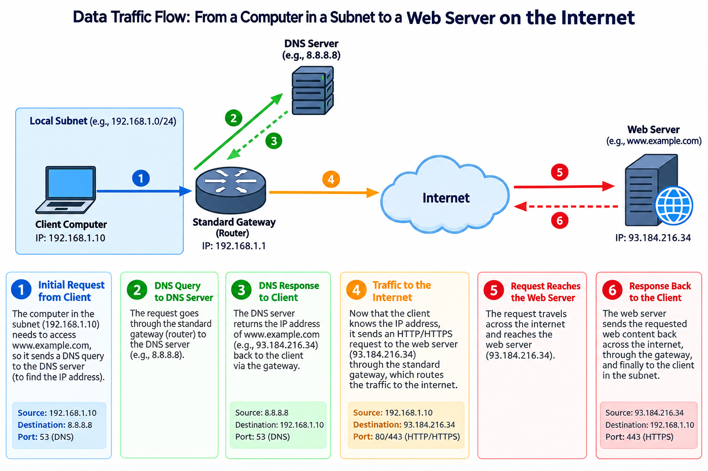

# Fördjupning mot VG krav

## Moment A: Avancerad Nätverksanalys & Trafikflöden (Mål 3)



### Bild förklaring

Bilden förklarar hur datatrafiken åker när en dator (som är konfiguerad med Googles DNS server på 8.8.8.8) ska in på hemsida.<br>
Den visar hur käll- och destinations IP-adresser ändras när man kommer till ändpunkter och information ska skickas tillbaka.<br>
Den visar hur man använder olika (logiska) portar för att använda olika tjänster (53 för DNS, 80 för HTTP och 443 för HTTPS)

### Bilden visar inte MAC-adresser

Bilden visar däremot inte MAC-adresser. MAC-adresser är adresser till specifika nätverks-interfaces. En dator brukar bara ha en, men en router kan ha många.<br>
När man skickar information i ett nätverk så använder man destinations-MAC-adressen som next-hop address; den ändras för varje interface som den åker emellan, till skillnad til IP-adresser som alltid är samma tills informationen ska till ett annat håll.

### TCP/IP modellen

MAC-adresser ligger på Länk-lagret (eller Network Access-lagret) på TCP/IP modellen<br>
IP-adresser ligger på Internet-lagret på TCP/IP modellen<br>
Port nummer ligger på Transport-lagret på TCP/IP modellen

## Moment B: Jämförande OS- och Behörighetsanalys (Mål 2)

### Linux

Skapa följande konto-struktur:<br>
<br>
**Grupper:**<br>
g_ledare (För chefer/ledare

```sudo groupadd g_ledare```

g_personal (För övrig personal)

```sudo groupadd g_personal```

Kommandorna förklarar sig själva. ```sudo``` behövs för att man måste ha admin-rättigheter för att lägga till grupper.<br>
<br>
**Användare:**<br>
alice (Medlem i g_ledare)

```sudo useradd -g g_ledare -s /bin/bash alice```

bob (Medlem i g_personal)

```sudo useradd -g g_personal -s /bin/bash bob```

```-g``` flaggan lägger den nya användaren i en grupp som man specifierar. ```-s``` väljer vilket shell den nya användaren ska logga in med, bash är en bra standard.<br>
<br>
<br>
Skapa en huvudmapp som heter Projekt med två undermappar:<br>
Projekt/Gemensamt<br>
Projekt/Ledning<br>